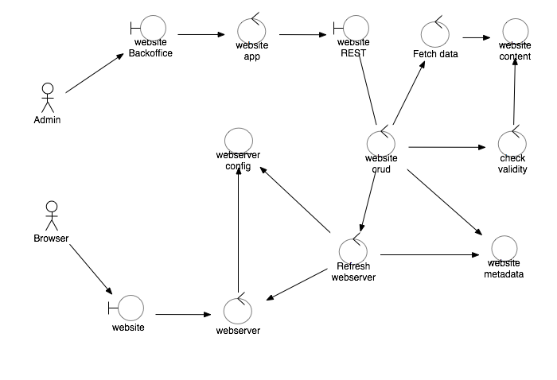

# Robustness analysis - deploy in minutes

## Diagram

A robustness diagram

## Interfaces

The interfaces of the system are:

* Backoffice : a nice BackOffice interface to create / delete / update / read the websites.

* Rest API : a REST api
    * *Create* : create a new website
    * *Read* : view metadata of website
    * *Update* : update metadata or content
    * *Delete* : delete the website

* Public website : the deployed public websites

## Processes

The processes of the system are:

* Website App : the backoffice application itself;
    * maybe : could be implemented as Angular / Bootstrap application.

* Website Crud process : the implementation of the REST API; this process is also
    * starting / stopping the webserver
        
* Fetch data : process to fetch the website data;
    * download the website data as a zip file and create the website content.

* Check validity : the checker process;
    * verify that the zip file can be unzipped;
    * verify there is at least an index.html content;
    * optional : check HTML / CSS / JS with standard tools.

* Webserver : the webserver serves the html pagesx

* Refresh webserver :
    * regenerates the whole webserver config;
    * makes the webserver reload its configuration.

## Entities

The entities of the system are:

* Website metadata
    * Provided data
        * content zipfile url 
        * logical name
    * Computed data
        * public url
        * log error path
        * log access path

* Website content
    * a filesystem directory containing all the resources

* Webserver config
    * a configuration file for the web server
